### [Home](https://dingusagar.github.io/cs7641-project/) |  [Proposal](https://dingusagar.github.io/cs7641-project/reports/proposal)  | [Midterm Report](https://dingusagar.github.io/cs7641-project/reports/midterm) | [Final Report](https://dingusagar.github.io/cs7641-project/reports/final)

# Final Report

<!-- vscode-markdown-toc -->
	* 1. [[Home](https://dingusagar.github.io/cs7641-project/) |  [Proposal](https://dingusagar.github.io/cs7641-project/reports/proposal)  | [Midterm Report](https://dingusagar.github.io/cs7641-project/reports/midterm) | [Midterm Report](https://dingusagar.github.io/cs7641-project/reports/final)](#Homehttps:dingusagar.github.iocs7641-projectProposalhttps:dingusagar.github.iocs7641-projectreportsproposalMidtermReporthttps:dingusagar.github.iocs7641-projectreportsmidtermMidtermReporthttps:dingusagar.github.iocs7641-projectreportsfinal)
* 1. [Introduction/Background](#IntroductionBackground)
* 2. [Problem Definition](#ProblemDefinition)
* 3. [Dataset](#Dataset)
	* 3.1. [Dataset origin](#Datasetorigin)
	* 3.2. [Dataset overview](#Datasetoverview)
	* 3.3. [Data Preprocessing](#DataPreprocessing)
* 4. [Methods and Results](#MethodsandResults)
	* 4.1. [Preprocessing](#Preprocessing)
		* 4.1.1. [Data Preprocessing](#DataPreprocessing-1)
		* 4.1.2. [Word Embedding](#WordEmbedding)
	* 4.2. [Unsupervised Learning](#UnsupervisedLearning)
		* 4.2.1. [Visualization Using PCA & t-SNE](#VisualizationUsingPCAt-SNE)
		* 4.2.2. [Clustering: K-means and Gaussian](#Clustering:K-meansandGaussian)
		* 4.2.3. [Top2Vec](#Top2Vec)
		* 4.2.4. [BERTopic](#BERTopic)
		* 4.2.5. [Discussion - Unsupervised](#Discussion-Unsupervised)
	* 4.3. [Supervised Learning](#SupervisedLearning)
		* 4.3.1. [Support Vector Classifier (SVC)](#SupportVectorClassifierSVC)
		* 4.3.2. [Logistic Regression](#LogisticRegression)
		* 4.3.3. [K-Means Classifier](#K-MeansClassifier)
		* 4.3.4. [Pretrained Sentiment Model](#PretrainedSentimentModel)
		* 4.3.5. [Fine-Tuned BERT](#FineTunedBERT)
    * 4.3.6. [LLM for Explanation Generation](#ExplanationGeneration)	
		* 4.3.7. [Discussion for Supervised](#DiscussionforSupervised)
* 5. [Gantt Chart](#GanttChart)
* 6. [Contribution Table](#ContributionTable)
* 7. [References](#References)

<!-- vscode-markdown-toc-config
	numbering=true
	autoSave=true
	/vscode-markdown-toc-config -->
<!-- /vscode-markdown-toc -->


##  1. <a name='IntroductionBackground'></a>Introduction/Background

`r/AmItheA*hole` (AITA) is a community where users seek judgment on whether their actions were the `A*hole` or not. Posts are classified as either negative (the `A*hole`) or positive (not the `A*hole`).

This project aligns with [stance detection](https://doi.org/10.1145/3369026), which involves classifying text as expressing favor, opposition, or neutrality. [Stance detection has been studied in social media platforms like Twitter](https://dl.acm.org/doi/10.1145/3003433). Additionally, [morality classification](https://ieeexplore.ieee.org/abstract/document/9240031?casa_token=IG_eXC9q7NkAAAAA:KCDtycMz9dtUCWgSbGHLirTB7oNwhPwApNIJWJNgyHom_rv8AnsJMLXGkDiqK72t6GZNM_ULsw), which involves assessing the ethical or moral stance of a text, is closely related to this work.

Our project falls in a similar category, which aims to build a morality classifier and generate explanations for why a post was classified as "the `A*hole`" or not.

##  2. <a name='ProblemDefinition'></a>Problem Definition

Develop ML model to classify posts from the AITA subreddit, determining whether the author is considered "the `A*hole`" or "Not the `A*hole`" based on the post content. Generate text explaining the classification.

This project aims to:

1. Act as an automated tone checker for writing
2. Explain why and how to adjust your writing to meet a tone

We are essentially making a “Grammarly” but for writing tone.

This report explains the usage of data preprocessing and unsupervised learning for EDA, detailing the efforts and attempts to classify the text using K-means clustering, Gaussian mixture models, and topic modeling.

##  3. <a name='Dataset'></a>Dataset

###  3.1. <a name='Datasetorigin'></a>Dataset origin
We have two datasets based on scraped contents of Reddit

1. [Reddit-AITA-2018-to-2022](https://huggingface.co/datasets/MattBoraske/Reddit-AITA-2018-to-2022/viewer/default/train?sort%5Bcolumn%5D=toxicity_label&sort%5Bdirection%5D=desc&p=2&row=9369)
2. [AITA-2018-2019](https://github.com/iterative/aita_dataset)

###  3.2. <a name='Datasetoverview'></a>Dataset overview
Our dataset contain `Title` , `Body`, `Comments`. Since `Comments` are lengthy text data, we convert it to a 2 value categorical feature called `Verdict` by taking majority counts of keywords `nta` or `yta` found in comments. After this process of converting `Comments` to `Verdict`, we use `Title` and `Body`as our features, and `Verdict` as our label.

Our dataset have a total of 123,954 records of reddit posts in AITA subreddits. The dataset has a skewed distribution in the `Verdict` feature, where only 30,048 records (24.2% of total) have a verdict of `yta` and 93,906 records (75.7% of total) have a verdict of `nta`.

###  3.3. <a name='DataPreprocessing'></a>Data Preprocessing
In order to combine the two raw dataset and create a single dataset for our use case, we took the following approach including text cleaning, data labelling, and data splitting.

1. Text Cleaning: The text cleaning pipeline preprocesses the dataset by cleaning text, tallying comment mentions, and merging datasets to assign verdicts. It converts submission text and top comments to lowercase, removes unnecessary punctuation, and tallies occurrences of `yta` and `nta` in the top comments. Then, it merges the dataset with an existing one containing `verdict`s, based on cleaned titles. The `verdict` for each entry is determined using either the comment tally or the known `verdict`, resulting in a cleaned and merged dataset for further analysis.
2. Data Labeling: Data in the HuggingFace dataset is unlabeled. We will use basic majority counts of keywords `nta` or `yta` found in comments to generate these labels.
3. Data Splitting: Finally, we spit data for training data (80%), test data (10%), and validation data (10%) so that we can fairly compare performance of different models that we explore

##  4. <a name='MethodsandResults'></a>Methods and Results

This section includes various ML methods we used for our project and the motivations for using them.

###  4.1. <a name='Preprocessing'></a>Preprocessing

####  4.1.1. <a name='DataPreprocessing-1'></a>Data Preprocessing
Initially, the data is preprocessed using basic text cleaning methods and applying embeddings to make the data suitable for machine learning algorithms. Please find the details of the previous section 3.3. [Data Preprocessing](#DataPreprocessing)

####  4.1.2. <a name='WordEmbedding'></a>Word Embedding

Word embedding is applied to the text as a preprocessing method to transform the dataset into a numerical representation, making it suitable for machine learning models. Top2Vec uses Doc2Vec and Word2Vec embeddings to group the documents into topics. For clustering and BERTopic, we use all-MiniLM-L6-v2, a sentence-transformers model that maps sentences and paragraphs to a 384-dimensional dense vector space. This encodes the text in a way that preserves semantic meaning.

###  4.2. <a name='UnsupervisedLearning'></a>Unsupervised Learning

####  4.2.1. <a name='VisualizationUsingPCAt-SNE'></a>Visualization Using PCA & t-SNE

Principal component analysis (PCA) is a dimensionality reduction technique that remaps features from the dataset into a reduced feature space. Here, we use PCA to visualize the data and understand its distribution, as well as to visualize clustering results. t-distributed Stochastic Neighbor Embedding (t-SNE) is similar to PCA but focuses on preserving the local structure of the data, potentially distorting the global structure. We also use t-SNE to visualize the clustering structure.

PCA and t-SNE on `title` embeddings both show two large clusters, but both do not have much information regarding the labels of interest.

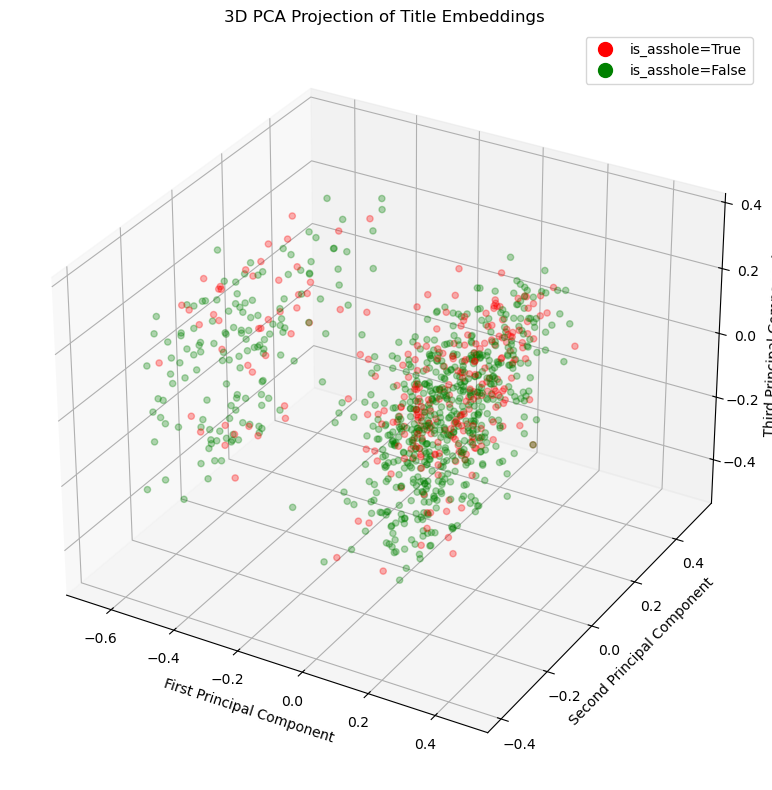
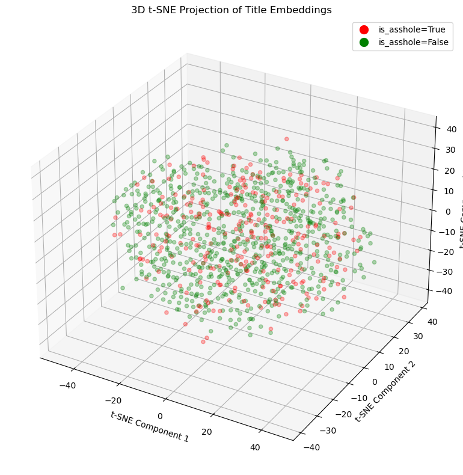

For `body` embeddings, the datapoints rather looked randomly scattered.

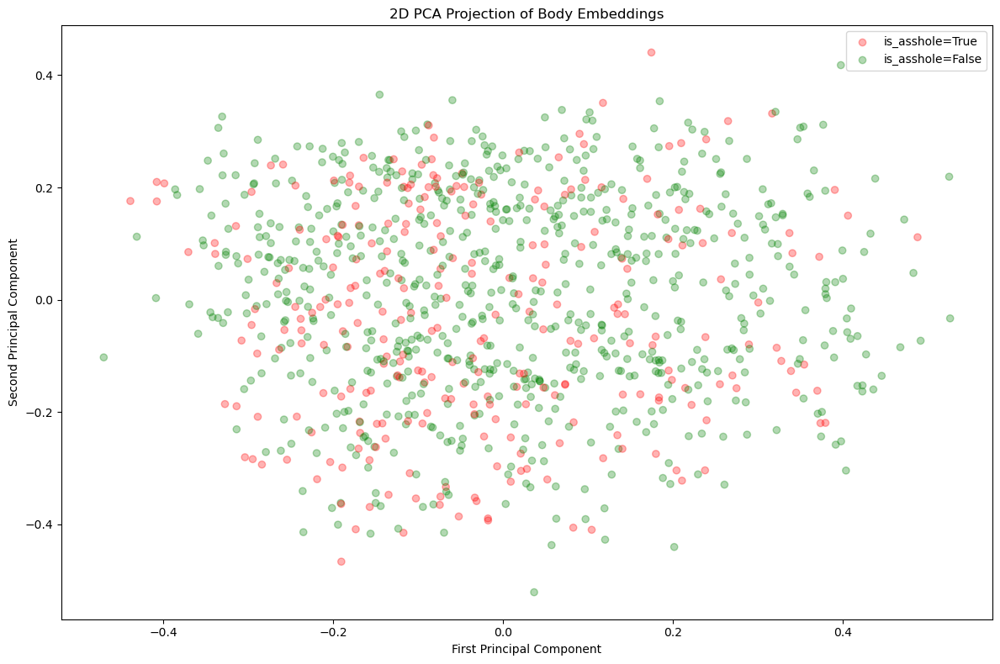

####  4.2.2. <a name='Clustering:K-meansandGaussian'></a>Clustering: K-means and Gaussian

K-Means clustering was used as an exploratory tool to detect potential natural groupings in the data without label supervision. Namely, it was applied to the goal of identifying inherent patterns in the AITA posts that could reveal how the language used in different posts aligns with the `yta` or `nta` labels. The Gaussian mixture models were chosen for their ability to model data distributions more flexibly than K-Means by assuming that data points were generated from a mixture of several Gaussian distributions. This approach offers an advantage for detecting soft clusters, where each post could belong to multiple clusters with varying probabilities. This probabilistic nature allows for a better understanding of ambiguous cases in AITA posts, where the classification of `yta` or `nta` might not be straightforward.

Clustering the embedded dataset has shown poor results. This is mainly due to the embedding's inability to capture the semantic characteristics of the given problem, which involves very specific topics. Visualization shows that the labels were spread almost randomly within the dataset, indicating little correlation with how it can be clustered. This is because the embeddings are based on generic models that fail to understand the subtle nuances of `yta` and `nta`.

The results of Gaussian mixture is visuallized as follows:

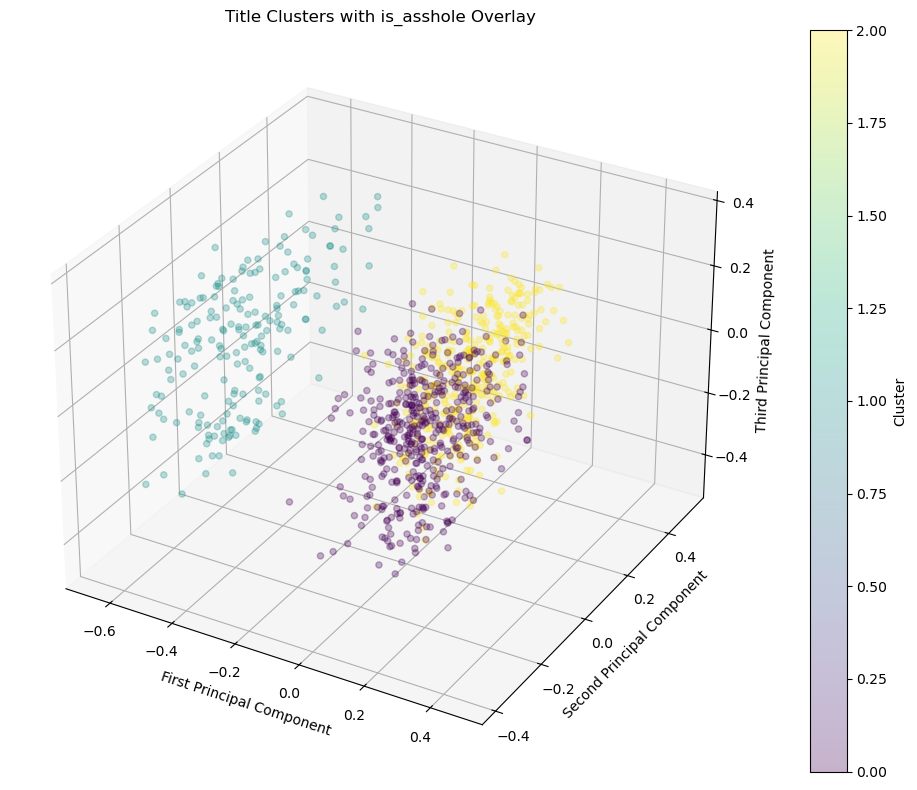
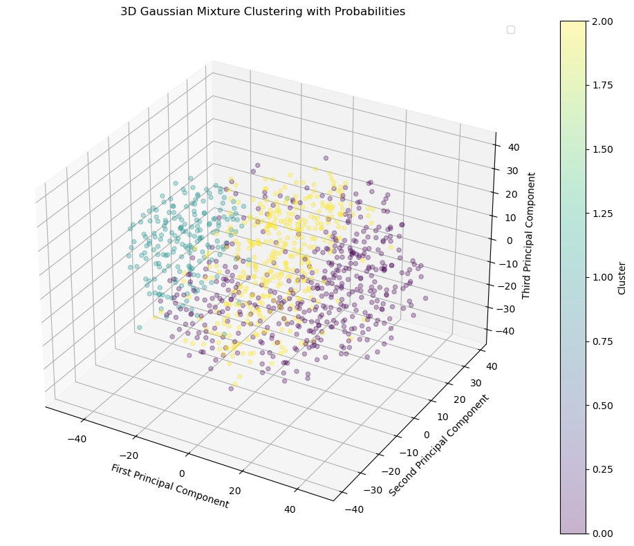

Simple clustering did not provide much promising results, and even larger numbers of clusters failed to capture any local structure regarding `yta` or `nta` labels. The following is a chart showing the percentile of `yta` within a cluster, which all are similar to the global percentile (near to 30%)

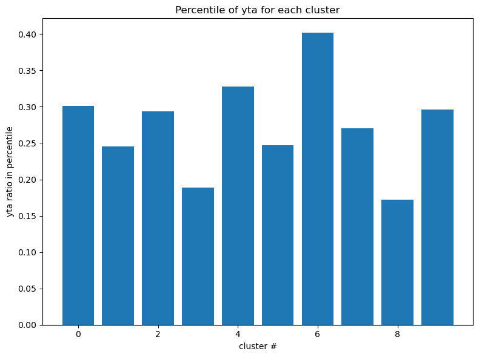
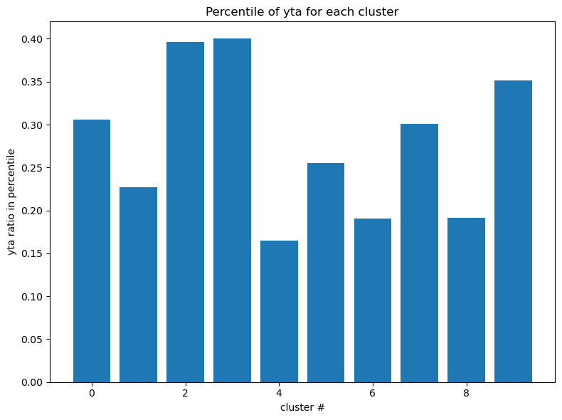

####  4.2.3. <a name='Top2Vec'></a>Top2Vec

Top2Vec was chosen for this project due to its capability of discovering topics within a dataset while simultaneously embedding documents and topics into a shared vector space. This unsupervised method is particularly beneficial for exploring latent structures in textual data, which aligns well with the goal of understanding the thematic content of AITA posts.

Top2Vec is an unsupervised topic modeling algorithm that simultaneously learns topic embeddings and document embeddings directly from text data. Precisely, Top2Vec first used Doc2Vec to train the embedding. Then, based on the embedding, Top2Vec used UMAP (Uniform Manifold Approximation and Projection) algorithm to reduce diemntion. Finally, Top2Vec uses HDBSCAN (Hierarchical Density-Based Spatial Clustering of Applications with Noise) to find clusters. The hyperparameter of epsilon is provided by us for this final step.

Top2Vec was applied on title and body on our dataset, as well as two different value of epsilon (0.1 and 0.2). We found that the Top2Vec resulted in more meaningful clusters when trained on the body rather than the title. When trained on the title, it focused too much on common words such as should, could, very, etc. and was not able to cluster effectively. When trained on body, the resulting clusters were much easier to understand and represented clear concepts such as travel, workplace, family, etc.

<table>
  <tr>
    <td>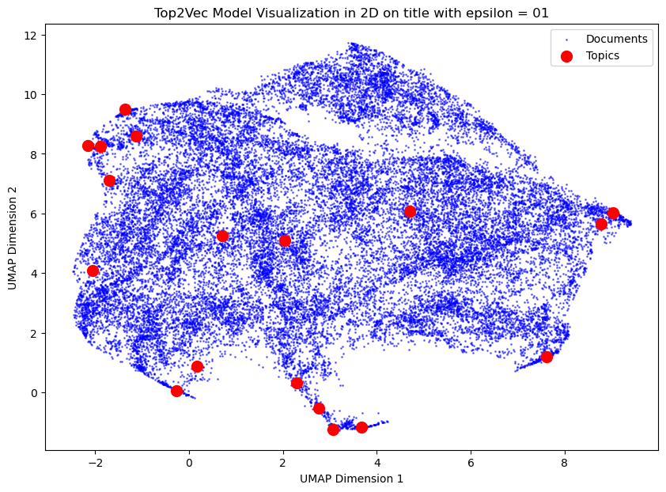</td>
    <td>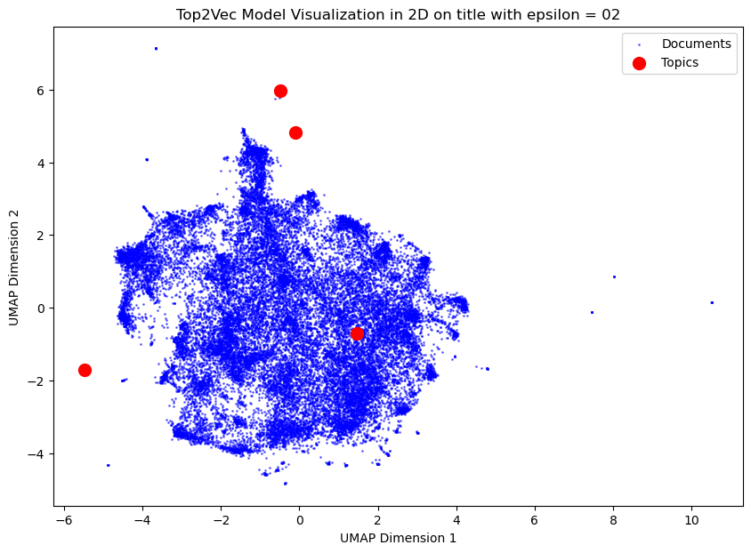</td>
  </tr>
  <tr>
    <td>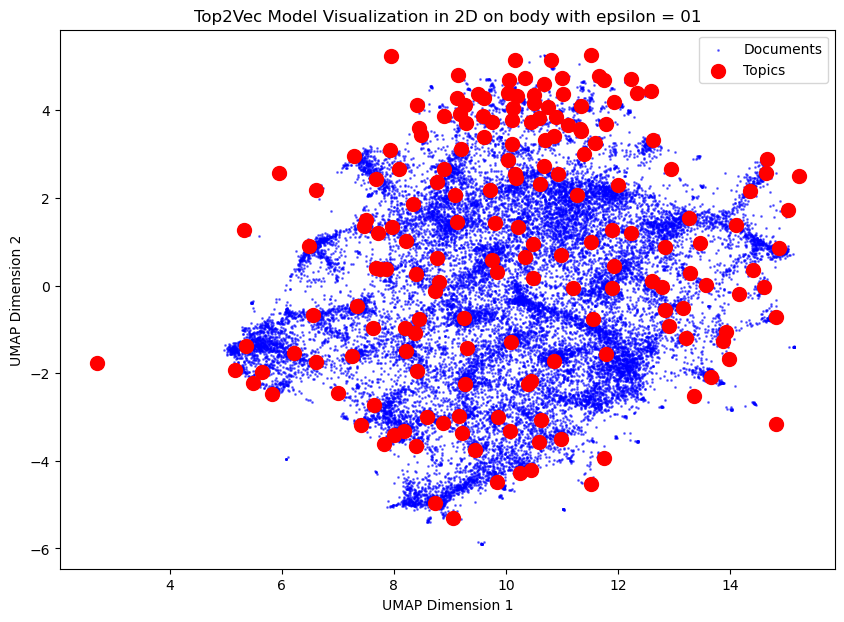</td>
    <td>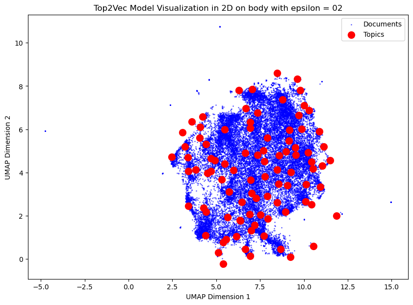</td>
  </tr>
</table>

The Top2Vec model trained on body with epsilon=0.2 outputted the most meaningful clusters. Below is word clouds from some of the topics. As shown in the word cloud, each topic has a clear category associated with them, such as finalcial problem, and romance.

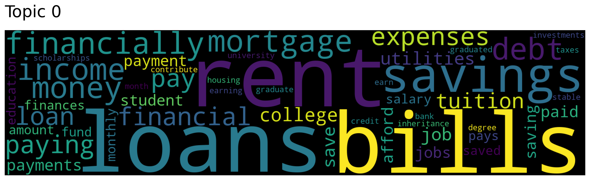
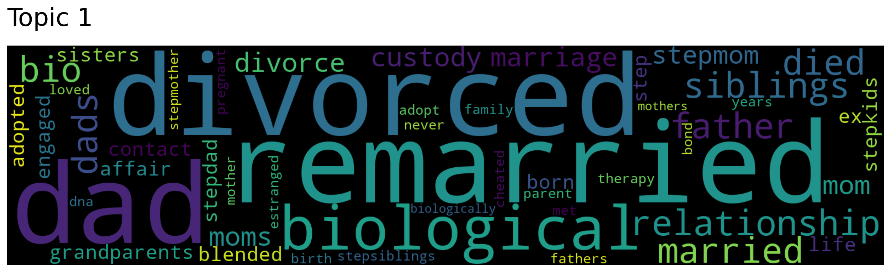
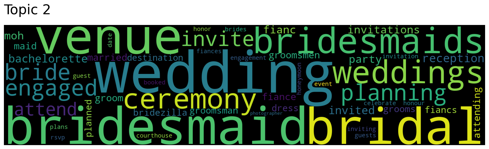
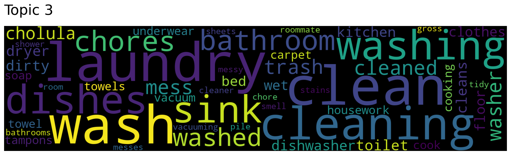

####  4.2.4. <a name='BERTopic'></a>BERTopic

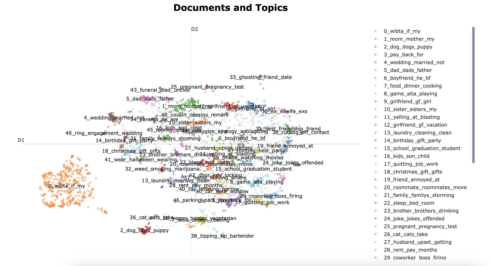
BERTopic is a topic modeling technique that leverages transformer-based embeddings (like BERT) to create dense representations of documents and uses clustering techniques (such as HDBSCAN) to discover topics in textual data. It excels in generating dynamic, interpretable topics while handling complex, high-dimensional text data. With respect to the AITA dataset, there was a need to understand more nuanced relationships between words and the context surrounding it. The questions and corresponding descriptions posted on the r/AITA subreddit are often heavily laden with context and colloquial language differences. Using a model like BERTopic helped ensure that the semantic meaning was reasonably captured.

We experimented the topic modelling algo on reddit post titles, descriptions and title + descriptions. We used embedding model [sentence-transformers/all-MiniLM-L6-v2](https://huggingface.co/sentence-transformers/all-MiniLM-L6-v2). The bertopic worked better when we gave only titles. Running on the entire dataset, we got around 900 meaningful topics. There were also noise topics like the first topic `wibta_if_my`. We plan to experiment with and without removing the outlier topics during our sueprvised learning stage of the project.  Interestingly giving the decriptions to the BERTopic made the topics less interesting since most of the topics were contaminated with stop words.

####  4.2.5. <a name='Discussion-Unsupervised'></a>Discussion - Unsupervised

Due to the complexity of the problem space, clustering does not provide much usefulness, even at a local level. While they successfully capture the clusters visible in the dimensionally reduced representation, the distribution of labels remains random. A simple demonstration is that when applying clustering for a larger K (in this case, 10), each cluster has a similar label ratio to the global distribution, showing no local optima. The clusters were spread similarly to the global label distribution, indicating that unsupervised learning methods may struggle to capture the subtleties of this problem without additional supervision.

Topic modeling shows reasonable performance in clustering the dataset into relevant topics, but it still fails to be precise enough to distinguish between `yta` and `nta`. The reasoning is similar to what we found with clustering. Our generic embedding models are not fine-tuned enough to capture the label-specific information.

###  4.3. <a name='SupervisedLearning'></a>Supervised Learning

We used **TF-IDF Vectorizer** from `sklearn` to convert the text data into numerical features. TF-IDF (Term Frequency-Inverse Document Frequency) assigns weights to words based on their importance in a document relative to the entire dataset. This method captures the relevance of each word, helping the models learn meaningful patterns.

####  4.3.1. <a name='SupportVectorClassifierSVC'></a>Support Vector Classifier (SVC)

The Support Vector Classifier was chosen for its robustness in binary & multi-class classification tasks, and its effectiveness in handling high-dimensional feature spaces. SVC works by finding a hyperplane that best separates data points of different classes in a high-dimensional space. For this project, the binary nature of the AITA labels (`yta` vs. `nta`) makes SVC a fitting choice, as it can define clear decision boundaries between the two classes. The use of a linear kernel is particularly suitable given the straightforward relationship we aim to capture between input features and labels. The model's ability to maximize the margin between classes helps mitigate the potential impact of noisy data and imbalances.

- **Feature extraction:** Text embeddings were used for clustering. These embeddings were obtained via scikit-learn's TfidfVectorizer function, with `max_features=50`.
- **Training:** The model was trained on labeled data after text cleaning and vectorization. We used SMOTE to balance the dataset, and used a train-test split of 0.3. We also stratified on `verdict` to obtain a more even dataset.

**Training Results:**

- Precision: 0.64 (`nta`), 0.62 (`yta`)
- Recall: 0.58 (`nta`), 0.68 (`yta`)
- F1-score: 0.61 (`nta`), 0.65 (`yta`)
- Accuracy: 63%

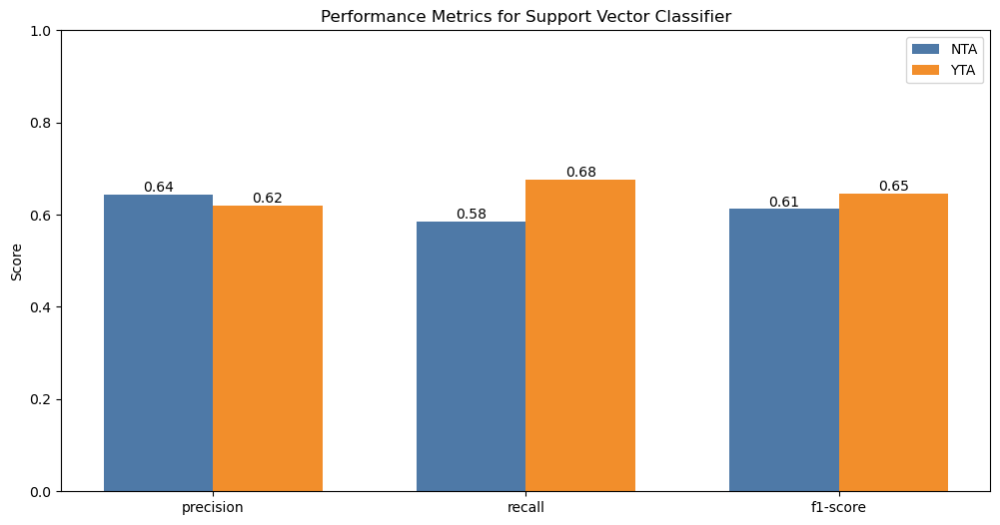

####  4.3.2. <a name='LogisticRegression'></a>Logistic Regression

Logistic Regression serves as a baseline for this project due to its simplicity and interpretability. Its use is grounded in the need for a straightforward, transparent model to establish initial performance metrics and provide insight into the linear relationships between input features and the AITA verdicts.

Logistic Regression is a statistical method for binary classification that models the probability of a label based on input features. It assumes a linear relationship between the input variables and the log odds of the outcome. This simplicity makes it a strong baseline classifier.

- **Feature extraction:** Text embeddings from the title and body were used for clustering. These embeddings were obtained via scikit-learn's TfidfVectorizer function, with `max_features=50`.
- **Training:** The model was trained on labeled data after text cleaning and vectorization. We used SMOTE to balance the dataset, and used a train-test split of 0.3. We also stratified on `verdict` to obtain a more even dataset.

**Training Results:**

- Precision: 0.63 (`nta`), 0.62 (`yta`)
- Recall: 0.61 (`nta`), 0.65 (`yta`)
- F1-score: 0.62 (`nta`), 0.64 (`yta`)
- Accuracy: 63%

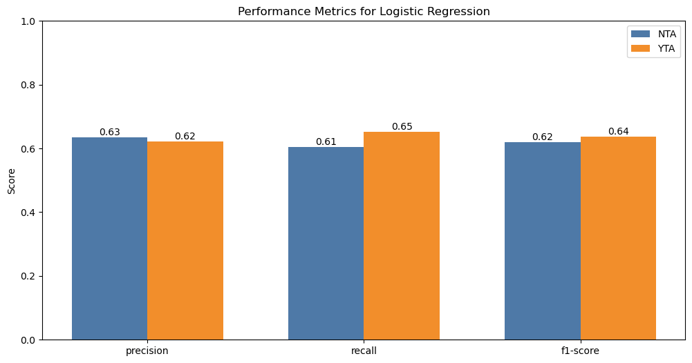

####  4.3.3. <a name='K-MeansClassifier'></a>K-Means Classifier

The K-Means classifier was explored as a creative approach to leverage unsupervised clustering for classification. While this approach is not commonly used for supervised learning, it provides a way to assess the natural separation between posts and test the feasibility of clustering-based predictions.

K-Means is an unsupervised clustering algorithm that assigns each data point to one of several clusters based on similarity. While it is not inherently a classifier, we used the clusters generated by K-Means to explore the possibility of classifying `yta` and `nta` posts.

- **Feature extraction:** Text embeddings from the title and body were used for clustering. These embeddings were obtained via scikit-learn's TfidfVectorizer function, with `max_features=50`.
- **Training:** We trained the K-Means algorithm with 2 clusters (matching the binary labels). We used SMOTE to balance our imbalanced dataset, and did a train-test split of 0.3. We stratified on the `verdict` to obtain more even train-test datasets.

**Training Results:**

- Precision: 0.56 (`nta`), 0.55 (`yta`)
- Recall: 0.52 (`nta`), 0.60 (`yta`)
- F1-score: 0.54 (`nta`), 0.58 (`yta`)
- Accuracy: 56%

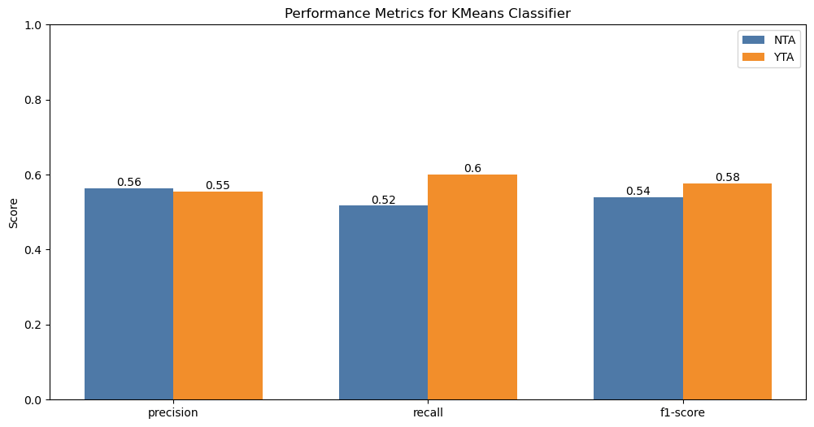

####  4.3.4. <a name='PretrainedSentimentModel'></a>Pretrained Sentiment Model

To establish a baseline on transformer models, we tried out a pretrained bert model [distilbert-base-uncased-finetuned-sst-2-english](https://huggingface.co/distilbert/distilbert-base-uncased-finetuned-sst-2-english) on our dataset which was finetuned for sentiment analysis task. The assumption we made for this experiment is the positive sentiment texts should correspond with the `nta` label and the negative sentiment corresponds to the `yta` label. This experiment aimed to determine whether a general-purpose sentiment analysis model could be repurposed to identify the polarity of user-submitted posts as a proxy for their overall judgment. Refer to the [Discussion for Supervised](#discussion-for-supervised) section more details.

**Training Results:**

- Precision: 0.83
- Recall: 0.017
- F1 Score: 0.034

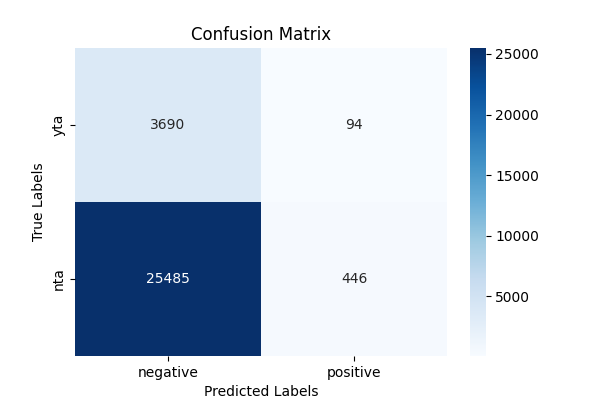

####  4.3.5 <a name='FineTunedBERT'></a> Fine-tuned BERT

Given the complex relation of the data and labels, we decided to leverage the capabilities of pretrained models, specifically BERT for sentiment analysis.

We had multiple considerations about fine tuning, which includes the following:

We wanted to avoid catastrophic forgetting, a phenomonon which the model loses previously acquired information by training from new data. Higher `weight_decay` and relatively lower `learning_rate` was used heavily penalize drastic changes of weights.

Validation error is got higher relatively fast, where we had to apply early stopping for the best performing model. Precision didn't change much during the training, increase of F1 score mostly comes from accuracy and recall - model is getting better on identifying more true positives and false negatives. We also tried to address the "dip" that shows in the early stages of training by decreasing learning rate, was able to alleviate it by tuning learning rate, but always happened.

Initial data had imbalance in classes, where `nta` had 3 times more occurences than `yta`. We tried both undersampling and oversampling to match the classes, which oversampling performed better. This would indicate despite the duplicate data in `yta`, a diversity of data even for a single class is more relevant. Advanced methods such as SMOTE was also in consideration, but such artificially generated data may not be relevant given the nature of the dataset, heavily dependent to natural language and its semantics. Additionally, batch size of 32 worked better than 64.

Training 3 epochs took ~ 14 minutes on H100 and ~ 32 minutes on L40S. The final results are plotted below:

**Training metrics**

Note that our model used the early stopped model near the 10th iteration.

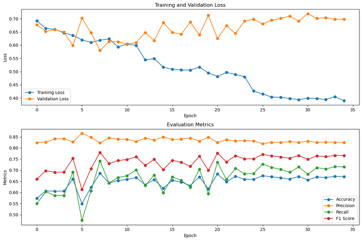

**Training Results**

* Accuracy: 0.68
* Precision: 0.82
* Recall: 0.73
* F1: 0.77

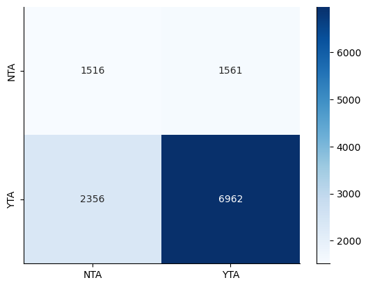

####  4.3.6. <a name='ExplanationGeneration'></a>LLM for Explanation Generation
We thought it would be interesting to generate an explanation for the predicted class similar to how real users would comment on the `r/AmItheA*hole` subreddit. We experimented a few open sourced LLMs using the `ollama` inference engine that can allow us to deploy on a cheap server without GPUs. The LLMs include - `llama3.2:3b`, `llama3.2:1b` and some quantized versions like `llama3.2:1b-instruct-q4_K_M` , `llama3.2:3b-instruct-q3_K_M` etc. The 1 billion models were poor at following the instructions. We finally went with the 3 billion parameter model (`llama3.2:3b`) whose explanations seemed reasonable. 

The llama models were too nice in it's explanations and would often tag the situations as `NTA`. We suspect it is due to the safety allignments that went in during it's training phase. To give an accurate classification and explanation for this task, we designed a hybrid system, where the class of `YTA` or `NTA` will be predicted by our finetuned BERT model, and the explanation would be generated by the llama model conditioned on the predicted class label from BERT. 

The instruction prompt for the llama model looks like this :  
```py
prompt = f"""
### You know about the subreddit community r/AmItheAsshole. In this community people post their life situations and ask if they are the asshole or not. 
The community uses the following acronyms. 
AITA : Am I the asshole? Usually posted in the question. 
YTA : You are the asshole in this situation.  
NTA : You are not the asshole in this situation.

### The task for you explain why a particular situation was tagged as NTA or YTA by most users. I will give the situation as well as the NTA or YTA tag. just give your explanation for the label. Be nice but give a brutally honest and unbiased view. Base your explanation entirely on the given text and the label tag only. Do not assume anything extra.  
Use second person terms like you in the explanation.

### Situation :  {question}
### Label Tag : {predicted_class_from_bert}
### Explanation for {predicted_class_from_bert} :"""
```

An example using this hybrid approach: 
```
Question : I told my kid that she should become an engineer like me, she is into painting and wants to pursue arts. AITA? 
Bert Prediction :  You are the A**hole (YTA) with confidence 88.18%
Explanation from Llama : In this situation, you are likely tagged as YTA because you discouraged your child from pursuing her passion for art, which may have led to disappointment and potentially hindered her self-expression. By strongly suggesting that she follow in your footsteps and become an engineer, you may have imposed your own career goals on your child without considering her interests or desires. This could be perceived as dismissive of her artistic aspirations and not supportive of her individuality.
```
The explanation is reasonable but it does not sound like the tone of the users' comments in the subreddit which are more casual and to the point.  An interesting future work beyond the scope of this semester project would be instruction-finetune this model on our dataset. 

####  4.3.7. <a name='DiscussionforSupervised'></a>Discussion for Supervised

Although the SVC performed well in terms of precision and recall, there was a slight imbalance in the recall values between the two classes. Further tuning of hyperparameters or class weights could improve the balance between predictions.

Logistic Regression demonstrated a balanced performance across precision and recall, making it a reliable model for this problem. However, the linearity assumption may limit its ability to capture complex relationships within the data.

For the pretrained sentiment model, the precision, recall and F1 score corresponds to the positive sentiment label which corresponds to the `nta` label in our dataset. We can see from the confusion matrix that most of the `nta` texts and the `yta` texts were labelled as negative sentiment. Our assumption about the association of `yta` and `nta` labels with the sentiments of the texts does not seem to hold true.

This shows us that our problem is non trivial where we can use a sentiment model to solve it. Therefore, this justifies the need for fine-tuning the model on our dataset to predict `nta` or `yta` labels correctly.

Fine-tuning BERT shows a much reasonable F1 score of 0.77, where the original model is a binary classifier where it predicits sentiment as labels `1` for `positive` and `0` for `negative`. Given that the `negative` label can be mapped into our dataset's `yta` label, it performed reasonably well on random examples from Reddit. For example, our classifier model predicted [this post](https://www.reddit.com/r/AmItheAsshole/comments/1gw9o5g/aita_for_defending_my_daughters_comments_towards/) as `yta` with `0.81` confidence and [this post](https://www.reddit.com/r/AmItheAsshole/comments/1gwl76e/aitah_for_refusing_to_let_my_moms_boyfriend_walk/) as `nta` with `0.98` confidence. The complexity of the given task having long paragraphs of input text required a much advanced model to capture the sentiment.

##  5. <a name='GanttChart'></a>Gantt Chart

[Link](https://docs.google.com/spreadsheets/d/18YNVB-EbJJxHQ7TgGCrHxtCeOkt0s-LmVG50PYV-BY0/edit?usp=sharing)

##  6. <a name='ContributionTable'></a>Contribution Table

| Name | Proposal Contributions |
|---|---|
| All | Writeup and discussion |
| All | References |
| Dingu | BERTopic, distilBERT sentiment model, explanation generation with Llama, live deployement |
| Ethan | Data organization and cleaning, K-means clustering |
| Kyu Yeon | Clustering, Gaussian Mixture, BERT fine-tuning |
| Lex | Supervised methods (SVC, logistic, k-means classifier)  |
| Yuto | Top2Vec |

##  7. <a name='References'></a>References

- [1] D. Küçük and F. Can, “Stance Detection,” ACM Computing Surveys, vol. 53, no. 1, pp. 1–37, Feb. 2020, doi: <https://doi.org/10.1145/3369026>.
- [2] S. M. Mohammad, P. Sobhani, and S. Kiritchenko, “Stance and Sentiment in Tweets,” ACM Transactions on Internet Technology, vol. 17, no. 3, pp. 1–23, Jul. 2017, doi: <https://doi.org/10.1145/3003433>.
- [3] M. C. Pavan et al., "Morality Classification in Natural Language Text," in IEEE Transactions on Affective Computing, vol. 14, no. 1, pp. 857-863, 1 Jan.-March 2023, doi: 10.1109/TAFFC.2020.3034050.
- [4] J. Devlin, M.-W. Chang, K. Lee, and K. Toutanova, “BERT: Pre-training of Deep Bidirectional Transformers for Language Understanding,” arXiv.org, Oct. 11, 2018. <https://arxiv.org/abs/1810.04805>
- [5] A. Vaswani et al., “Attention Is All You Need,” arXiv.org, Jun. 12, 2017. <https://arxiv.org/abs/1706.03762>
- [6] K. Pham, “Text Classification with BERT,” Medium, May 09, 2023. <https://medium.com/@khang.pham.exxact/text-classification-with-bert-7afaacc5e49b>
- [7] “sentence-transformers/all-MiniLM-L12-v2 · Hugging Face,” huggingface.co, Jun. 08, 2023. <https://huggingface.co/sentence-transformers/all-MiniLM-L12-v2>
