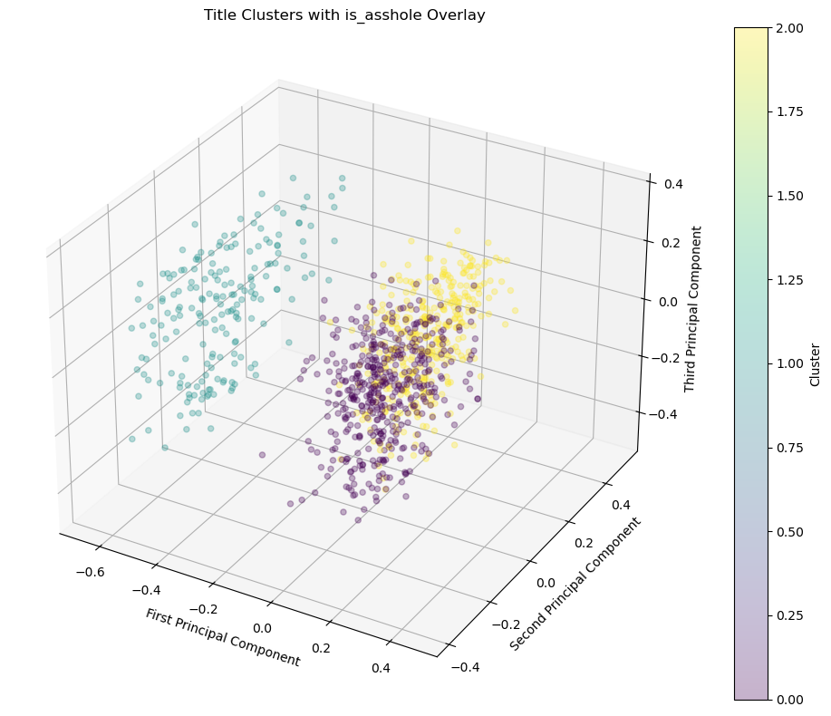
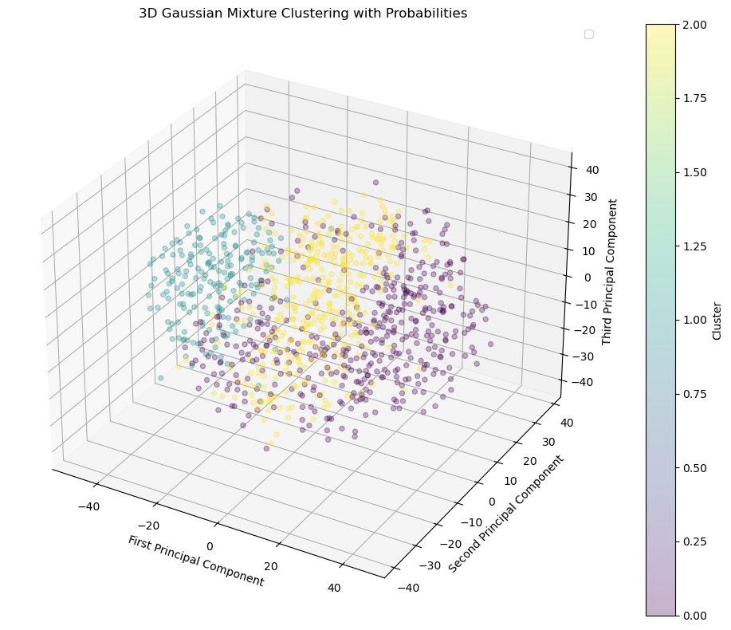
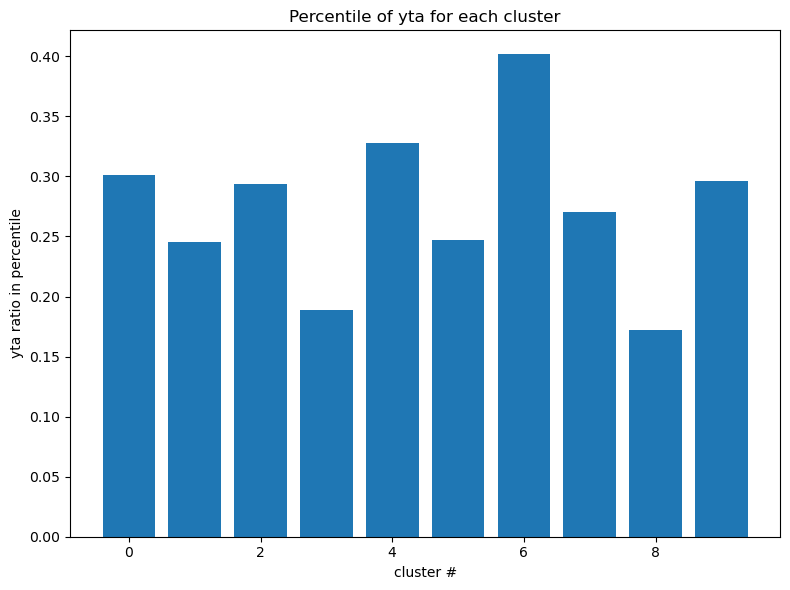
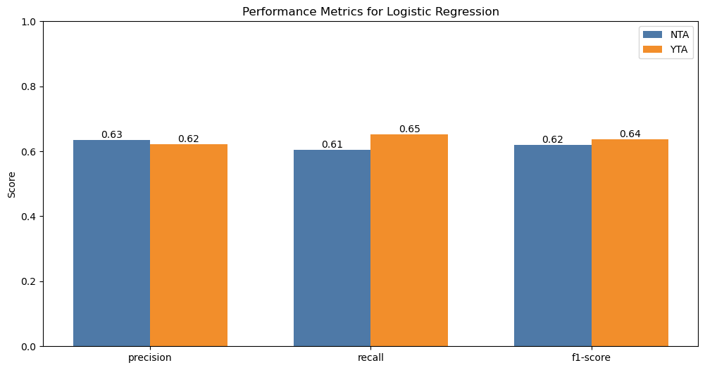

### [Home](https://dingusagar.github.io/cs7641-project/) |  [Proposal](https://dingusagar.github.io/cs7641-project/proposal)  | [Midterm Report](https://dingusagar.github.io/cs7641-project/midterm)

# Midterm Report
This is the midterm page. Include midterm-related content here.

## Introduction/Background

`r/AmItheA*hole` (AITA) is a community where users seek judgment on whether their actions were the `A*hole` or not. Posts are classified as either negative (the `A*hole`) or positive (not the `A*hole`).

This project aligns with [stance detection](https://doi.org/10.1145/3369026), which involves classifying text as expressing favor, opposition, or neutrality. [Stance detection has been studied in social media platforms like Twitter](https://dl.acm.org/doi/10.1145/3003433). Additionally, [morality classification](https://ieeexplore.ieee.org/abstract/document/9240031?casa_token=IG_eXC9q7NkAAAAA:KCDtycMz9dtUCWgSbGHLirTB7oNwhPwApNIJWJNgyHom_rv8AnsJMLXGkDiqK72t6GZNM_ULsw), which involves assessing the ethical or moral stance of a text, is closely related to this work.

Our project falls in a similar category, which aims to build a morality classifier and generate explanations for why a post was classified as "the `A*hole`" or not.

## Problem Definition

This report explains the usage of data preprocessing and unsupervised learning for EDA, detailing the efforts and attempts to classify the text using K-means clustering, Gaussian mixture models, and topic modeling.

## Methods

This section includes various ML methods we used for our project.

### Preprocessing

The data is preprocessed using basic text cleaning methods and applying embeddings to make the data suitable for machine learning algorithms.

#### Text Cleaning

The text cleaning pipeline preprocesses the dataset by cleaning text, tallying comment mentions, and merging datasets to assign verdicts. It converts submission text and top comments to lowercase, removes unnecessary punctuation, and tallies occurrences of `yta` and `nta` in the top comments. Then, it merges the dataset with an existing one containing `verdict`s, based on cleaned titles. The `verdict` for each entry is determined using either the comment tally or the known `verdict`, resulting in a cleaned and merged dataset for further analysis.

#### Word Embedding

Word embedding is applied to the text as a preprocessing method to transform the dataset into a numerical representation, making it suitable for machine learning models. Top2Vec uses Doc2Vec and Word2Vec embeddings to group the documents into topics. For clustering and BERTopic, we use all-MiniLM-L6-v2, a sentence-transformers model that maps sentences and paragraphs to a 384-dimensional dense vector space. This encodes the text in a way that preserves semantic meaning.

### Unsupervised Learning

#### Visualization Using PCA & t-SNE

Principal component analysis (PCA) is a dimensionality reduction technique that remaps features from the dataset into a reduced feature space. Here, we use PCA to visualize the data and understand its distribution, as well as to visualize clustering results. t-distributed Stochastic Neighbor Embedding (t-SNE) is similar to PCA but focuses on preserving the local structure of the data, potentially distorting the global structure. We also use t-SNE to visualize the clustering structure.

#### K-means and Gaussian Mixture

We first apply clustering to see if it can capture any patterns. We apply K-means clustering and Gaussian mixture models to evaluate performance; however, due to the complexity of the problem space, these methods do not provide much usefulness, even at a local level. While they successfully capture the clusters visible in the dimensionally reduced representation, the distribution of labels remains random. A simple demonstration is that when applying clustering for a larger K (in this case, 10), each cluster has a similar label ratio to the global distribution, showing no local optima. The poor performance of clustering will be further discussed in the remainder of this report.

The results from K-Means show that clustering alone was not sufficient for accurate classification. The clusters were spread similarly to the global label distribution, indicating that unsupervised learning methods may struggle to capture the subtleties of this problem without additional supervision.

#### Top2Vec

Top2Vec is an unsupervised topic modeling algorithm that simultaneously learns topic embeddings and document embeddings directly from text data. Precisely, Top2Vec first used Doc2Vec to train the embedding. Then, based on the embedding, Top2Vec used UMAP (Uniform Manifold Approximation and Projection) algorithm to reduce diemntion. Finally, Top2Vec uses HDBSCAN (Hierarchical Density-Based Spatial Clustering of Applications with Noise) to find clusters. The hyperparameter of epsilon is provided by us for this final step.

#### BERTopic

BERTopic is a topic modeling technique that leverages transformer-based embeddings (like BERT) to create dense representations of documents and uses clustering techniques (such as HDBSCAN) to discover topics in textual data. It excels in generating dynamic, interpretable topics while handling complex, high-dimensional text data.

### Supervised Learning

#### Support Vector Classifier (SVC), Logistic Regression, and K-Means Classifier

We used **TF-IDF Vectorizer** from `sklearn` to convert the text data into numerical features. TF-IDF (Term Frequency-Inverse Document Frequency) assigns weights to words based on their importance in a document relative to the entire dataset. This method captures the relevance of each word, helping the models learn meaningful patterns.

Support Vector Classifier (SVC) is a powerful supervised learning algorithm used for binary and multi-class classification tasks. SVC works by finding a hyperplane that best separates data points of different classes in a high-dimensional space. For our AITA dataset, we used a linear kernel to train the SVC, given the binary nature of the labels (`yta` vs. `nta`).

- **Feature extraction:** Text embeddings were used for clustering. These embeddings were obtained via scikit-learn's TfidfVectorizer function, with `max_features=50`.
- **Training:** The model was trained on labeled data after text cleaning and vectorization. We used SMOTE to balance the dataset, and used a train-test split of 0.3. We also stratified on `verdict` to obtain a more even dataset.

#### Logistic Regression

Logistic Regression is a statistical method for binary classification that models the probability of a label based on input features. It assumes a linear relationship between the input variables and the log odds of the outcome. This simplicity makes it a strong baseline classifier.

- **Feature extraction:** Text embeddings from the title and body were used for clustering. These embeddings were obtained via scikit-learn's TfidfVectorizer function, with `max_features=50`.
- **Training:** The model was trained on labeled data after text cleaning and vectorization. We used SMOTE to balance the dataset, and used a train-test split of 0.3. We also stratified on `verdict` to obtain a more even dataset.

#### K-Means Classifier

K-Means is an unsupervised clustering algorithm that assigns each data point to one of several clusters based on similarity. While it is not inherently a classifier, we used the clusters generated by K-Means to explore the possibility of classifying `yta` and `nta` posts.

- **Feature extraction:** Text embeddings from the title and body were used for clustering. These embeddings were obtained via scikit-learn's TfidfVectorizer function, with `max_features=50`.
- **Training:** We trained the K-Means algorithm with 2 clusters (matching the binary labels). We used SMOTE to balance our imbalanced dataset, and did a train-test split of 0.3. We stratified on the `verdict` to obtain more even train-test datasets.

#### Pretrained Sentiment Model

To establish a baseline on transformer models, we tried out a pretrained bert model [distilbert-base-uncased-finetuned-sst-2-english](https://huggingface.co/distilbert/distilbert-base-uncased-finetuned-sst-2-english) on our dataset which was finetuned for sentiment analysis task. The assumption we made for this experiment is the positive sentiment texts should correspond with the `nta` label and the negative sentiment corresponds to the `yta` label. Refer to the results and discussion section more details.

## Results and Discussion

### Visualization

PCA and t-SNE on `title` embeddings both show two large clusters, but both do not have much information regarding the labels of interest.

For `body` embeddings, the datapoints rather looked randomly scattered.

### Clustering

Clustering the embedded dataset has shown poor results. This is mainly due to the embedding's inability to capture the semantic characteristics of the given problem, which involves very specific topics. Visualization shows that the labels were spread almost randomly within the dataset, indicating little correlation with how it can be clustered. This is because the embeddings are based on generic models that fail to understand the subtle nuances of `yta` and `nta`.

The results of Gaussian mixture is visuallized as follows:

Simple clustering did not provide much promising results, and even larger numbers of clusters failed to capture any local structure regarding `yta` or `nta` labels. The following is a chart showing the percentile of `yta` within a cluster, which all are similar to the global percentile (near to 30%)

### Topic Modeling

Topic modeling shows reasonable performance in clustering the dataset into relevant topics, but it still fails to be precise enough to distinguish between `yta` and `nta`. The reasoning is similar to what we found with clustering. Our generic embedding models are not fine-tuned enough to capture the label-specific information.

Top2Vec was applied on title and body on our dataset, as well as two different value of epsilon (0.1 and 0.2). We found that the Top2Vec resulted in more meaningful clusters when trained on the body rather than the title. When trained on the title, it focused too much on common words such as should, could, very, etc. and was not able to cluster effectively. When trained on body, the resulting clusters were much easier to understand and represented clear concepts such as travel, workplace, family, etc.

<table>
  <tr>
    <td></td>
    <td></td>
  </tr>
  <tr>
    <td></td>
    <td></td>
  </tr>
</table>

The Top2Vec model trained on body with epsilon=0.2 outputted the most meaningful clusters. Below is word clouds from some of the topics. As shown in the word cloud, each topic has a clear categori associated with them, such as finalcial problem, and romance.

For BERTopic, we experimented the topic modelling algo on reddit post titles, descriptions and title + descriptions. We used embedding model [sentence-transformers/all-MiniLM-L6-v2](https://huggingface.co/sentence-transformers/all-MiniLM-L6-v2). The bertopic worked better when we gave only titles. Running on the entire dataset, we got around 900 meaningful topics. There were also noise topics like the first topic `wibta_if_my`. We plan to experiment with and without removing the outlier topics during our sueprvised learning stage of the project.  Interestingly giving the decriptions to the BERTopic made the topics less interesting since most of the topics were contaminated with stop words.

### Supervised Methods

#### Support vector classifier

**Training Results:**

- Precision: 0.64 (`nta`), 0.62 (`yta`)
- Recall: 0.58 (`nta`), 0.68 (`yta`)
- F1-score: 0.61 (`nta`), 0.65 (`yta`)
- Accuracy: 63%

Although the SVC performed well in terms of precision and recall, there was a slight imbalance in the recall values between the two classes. Further tuning of hyperparameters or class weights could improve the balance between predictions.

#### Logistic regression

**Training Results:**

- Precision: 0.63 (`nta`), 0.62 (`yta`)
- Recall: 0.61 (`nta`), 0.65 (`yta`)
- F1-score: 0.62 (`nta`), 0.64 (`yta`)
- Accuracy: 63%

Logistic Regression demonstrated a balanced performance across precision and recall, making it a reliable model for this problem. However, the linearity assumption may limit its ability to capture complex relationships within the data.

#### K-means classifier

**Training Results:**

- Precision: 0.56 (`nta`), 0.55 (`yta`)
- Recall: 0.52 (`nta`), 0.60 (`yta`)
- F1-score: 0.54 (`nta`), 0.58 (`yta`)
- Accuracy: 56%

#### Pretrained Sentiment Model
Precision: 0.83 \
Recall: 0.017 \
F1 Score: 0.034

The precision, recall and F1 score corresponds to the positive sentiment label which corresponds to the `nta` label in our dataset.
We can see from the confusion matrix that most of the `nta` texts and the `yta` texts were labelled as negative sentiment.
Our assumption about the association of `yta` and `nta` labels with the sentiments of the texts does not seem to hold true.

This shows us that our problem is non trivial where we can use a sentiment model to solve it. And this justifies the need for finetuning the model on our dataset to predict `nta` or `yta` labels correctly.

### Further Work

#### Revisit Data Cleaning

Keywords like `WIBTA` and `AITA` are commonly used and may be considered noise. Additionally, some data points contain only a URL in the `body`, which provides little context and should also be treated as noise. Lastly, the dataset itself is imbalanced between labels `yta` and `nta`, which should also be addressed.

#### Revisit Word Embedding

We plan to use fine-tuned, domain-specific word embeddings for this task to see if they structure the data in a way that better aligns with the labels.

#### Fine Tuning Pre-Trained models

Since the pretrained sentiment models did not work well for our task, we will investigate finetuning bert models on our dataset. Fine-tuning a pre-trained model on our dataset allows us to leverage its general language understanding while adapting it to the specific nuances of AITA posts. This approach helps the model pick up on informal language, unique phrasing, and moral judgments common in our data. By fine-tuning, the model can better recognize subtle cues like sarcasm or rudeness, which are key for accurately predicting verdicts. It improves classification performance without needing to start from scratch, making the process more efficient while building on the strengths of an existing model.

## Gantt Chart

[Link](https://docs.google.com/spreadsheets/d/18YNVB-EbJJxHQ7TgGCrHxtCeOkt0s-LmVG50PYV-BY0/edit?usp=sharing)

## Contribution Table

| Name | Proposal Contributions |
|---|---|
| All | Writeup and discussion |
| All | References |
| Dingu | BERTopic |
| Ethan | Data organization and cleaning, K-means clustering |
| Kyu Yeon | Clustering, Gaussian Mixture |
| Lex | Supervised methods (SVC, logistic, k-means classifier)  |
| Yuto | Top2Vec |

## References

* [1] D. Küçük and F. Can, “Stance Detection,” ACM Computing Surveys, vol. 53, no. 1, pp. 1–37, Feb. 2020, doi: <https://doi.org/10.1145/3369026>.
* [2] S. M. Mohammad, P. Sobhani, and S. Kiritchenko, “Stance and Sentiment in Tweets,” ACM Transactions on Internet Technology, vol. 17, no. 3, pp. 1–23, Jul. 2017, doi: <https://doi.org/10.1145/3003433>.
* [3] M. C. Pavan et al., "Morality Classification in Natural Language Text," in IEEE Transactions on Affective Computing, vol. 14, no. 1, pp. 857-863, 1 Jan.-March 2023, doi: 10.1109/TAFFC.2020.3034050.
* [4] J. Devlin, M.-W. Chang, K. Lee, and K. Toutanova, “BERT: Pre-training of Deep Bidirectional Transformers for Language Understanding,” arXiv.org, Oct. 11, 2018. <https://arxiv.org/abs/1810.04805>
* [5] A. Vaswani et al., “Attention Is All You Need,” arXiv.org, Jun. 12, 2017. <https://arxiv.org/abs/1706.03762>
* [6] K. Pham, “Text Classification with BERT,” Medium, May 09, 2023. <https://medium.com/@khang.pham.exxact/text-classification-with-bert-7afaacc5e49b>
* [7] “sentence-transformers/all-MiniLM-L12-v2 · Hugging Face,” huggingface.co, Jun. 08, 2023. <https://huggingface.co/sentence-transformers/all-MiniLM-L12-v2>
‌
